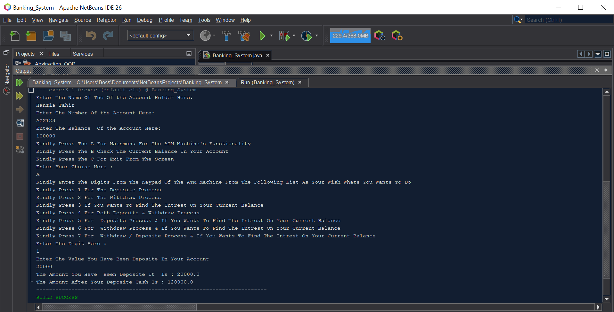

# Java Banking System (ATM Simulation) — Console App

A simple **Java-based Banking System (ATM Simulation)** built with OOP principles and designed to run in the console.
It supports **Deposit**, **Withdraw**, **Balance Inquiry**, **Interest Calculation**, and **Combined Operations**. Perfect for learning and showcasing Java OOP.

> Created by **Hanzla Tahir** — built in NetBeans.

---

## ✨ Features
- Deposit money
- Withdraw money
- Check balance
- Calculate interest on current balance
- Combined operations (deposit → withdraw → interest)
- Clean, beginner-friendly console UI
- OOP structure (abstraction, encapsulation, and modular classes)

---

## 🧩 How It’s Structured (Example)
```
src/
├─ model/
│  ├─ Account.java
│  └─ Transaction.java
├─ service/
│  ├─ BankingService.java
│  └─ InterestCalculator.java
└─ app/
   └─ Main.java         <-- entry point (update this if your class is different)
```
> Your actual package names/classes may differ. Update names in the run commands below accordingly.

---

## 🛠️ Tech
- Java (JDK 17+ recommended, works with JDK 21 as well)
- NetBeans (recent release)
- Git & GitHub for version control

---

## 🚀 Run Locally

### Option A) Run in NetBeans
1. **File → Open Project…** and select your project folder.
2. Right–click the project → **Clean and Build**.
3. Right–click the project → **Run**.
4. If needed, set the **Main Class**: Right–click project → **Properties → Run** → set to your entry class (e.g., `app.Main`).

### Option B) Run from Command Line
From the project root (where `src/` lives), run:
```bash
# Compile (adjust package path if needed)
javac -d bin $(find src -name "*.java")

# Run (replace app.Main with your main class incl. package)
java -cp bin app.Main
```
> On Windows (PowerShell), use:
```powershell
# Compile
Get-ChildItem -Recurse -Filter *.java src | ForEach-Object { $_.FullName } | % { $_ } | Set-Content sources.txt
javac -d bin @sources.txt

# Run (replace app.Main)
java -cp bin app.Main
```

---

## 🧪 Sample Menu (Example)
```
==== ATM Menu ====
1) Deposit
2) Withdraw
3) Check Balance
4) Calculate Interest
5) Combined (Deposit + Withdraw + Interest)
0) Exit
```

---

## 📸 Screenshots

### Home Screen


---

## 📦 Packaging
- Keep your source code in `src/`
- Avoid committing build/ or dist/ folders (already handled by `.gitignore`)
- If you use Maven or Gradle, commit `pom.xml` or `build.gradle`

---

## 🧭 Roadmap / Ideas
- Multiple accounts
- PIN authentication
- Transaction history
- File or DB persistence

---

## 🙌 Acknowledgements
- Java community & NetBeans

---

## 🏷️ License
MIT — feel free to use, modify, and share.
